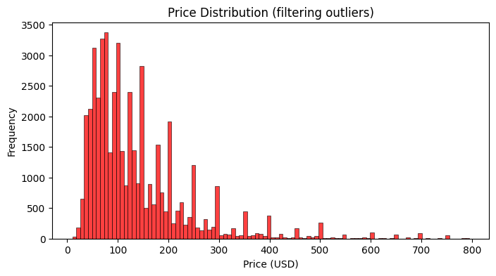
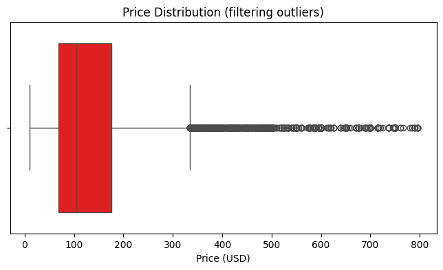
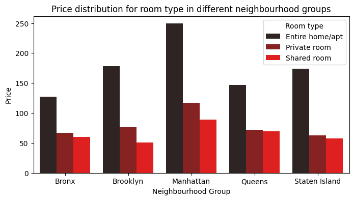
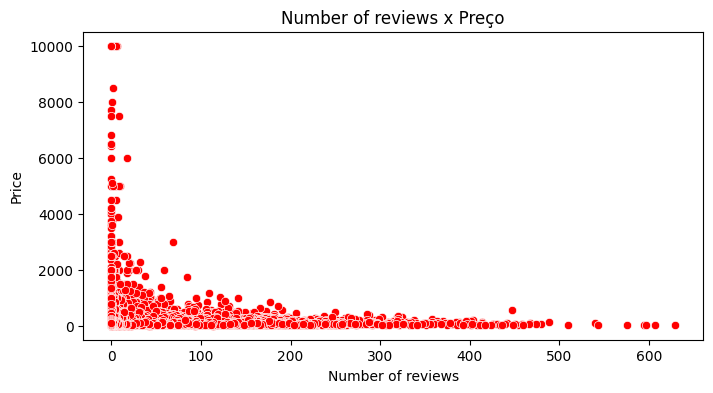
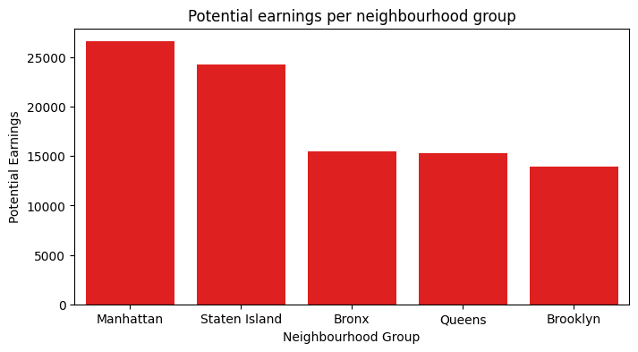
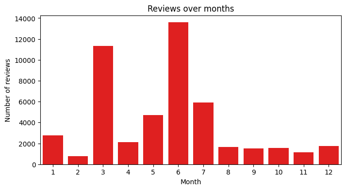
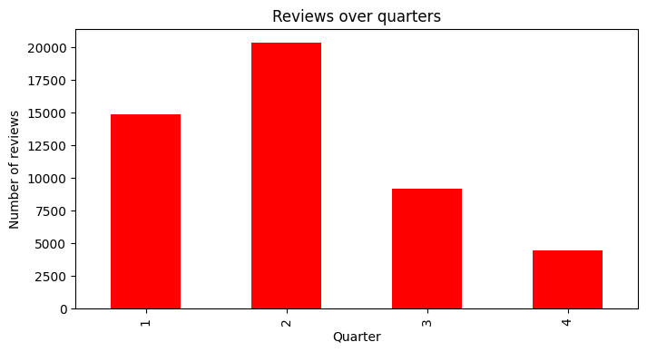
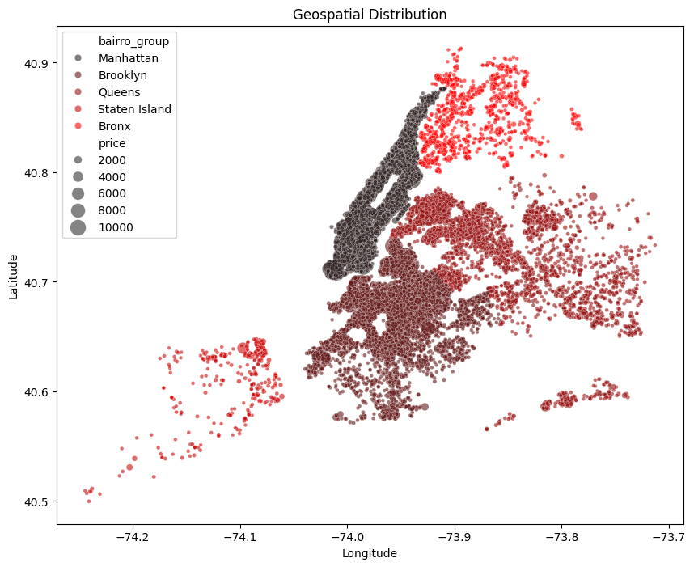
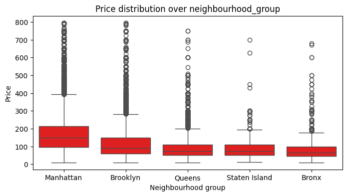

# Report for EDA of temporary lease app

- [Report for EDA of temporary lease app](#report-for-eda-of-temporary-lease-app)
  - [Objectives](#objectives)
  - [Data overview](#data-overview)
    - [Numeric columns analysis](#numeric-columns-analysis)
    - [Categorical columns analysis](#categorical-columns-analysis)
    - [Treating the data](#treating-the-data)
      - [Filling in NaN values](#filling-in-nan-values)
      - [Removing null price values](#removing-null-price-values)
  - [General price distribution](#general-price-distribution)
  - [Answering business insights](#answering-business-insights)
    - [1. How do the prices vary between neighbourhoods and type of room?](#1-how-do-the-prices-vary-between-neighbourhoods-and-type-of-room)
    - [2. Do ads with more reviews have higher prices?](#2-do-ads-with-more-reviews-have-higher-prices)
    - [3. Which neighbourhoods have higher availability and potential earnings?](#3-which-neighbourhoods-have-higher-availability-and-potential-earnings)
    - [4. Do hosts with more property have a higher mean price?](#4-do-hosts-with-more-property-have-a-higher-mean-price)
    - [5. When do more bookings happen, is there any seasonality in the bookings rate?](#5-when-do-more-bookings-happen-is-there-any-seasonality-in-the-bookings-rate)
    - [6. Does the location have any impact on the property's price?](#6-does-the-location-have-any-impact-on-the-propertys-price)
    - [7. Do the minimum number of nights and the year long availability have any impact on property price?](#7-do-the-minimum-number-of-nights-and-the-year-long-availability-have-any-impact-on-property-price)
    - [8. Is there any pattern in the property's name for places with higher price?](#8-is-there-any-pattern-in-the-propertys-name-for-places-with-higher-price)
  - [Modeling](#modeling)
    - [Model Type](#model-type)
    - [Possible Model Improvements](#possible-model-improvements)
    - [Encoding](#encoding)
    - [Model 1](#model-1)
    - [Model 2](#model-2)
  - [Calculating Price for a Given Entry](#calculating-price-for-a-given-entry)
    - [Model 1 Prediction](#model-1-prediction)
    - [Model 2 Prediction](#model-2-prediction)

## Objectives

The main objective of the EDA is to answer the following questions about the data:

1. How do the prices vary between neighbourhoods and type of room?
2. Do ads with more reviews have higher prices?
3. Which neighbourhoods have greater availability and potential earnings?
4. Do hosts with more property have a higher mean price?
5. When do more bookings happen, is there any seasonality in the bookings rate?
6. Does the location have any impact on the property's price?
7. Do the minimum number of nights and the year long availability have any impact on property price?
8. Is there any pattern in the property's name for places with higher price?

## Data overview

The data is composed of a total of $16$ columns and $48894$ entries.

```python
df.shape
```

Output:

```
(48894, 16)
```

The feature columns and their definition are as follows:

- `id` - works as a unique key for each ad on the app `text`
- `nome` - property's name - `text`
- `host_id` - id of host - `text`
- `host_name` – name of host - `text`
- `bairro_group` - neighbourhood area where property is located - `text/categoric`
- `bairro` - neighbourhood where the property is located - `text/categoric`
- `latitude` - latitude - `numeric`
- `longitude` - longitude - `numeric`
- `room_type` – the property type - `text/categoric`
- `price` - price in dollars listed by host - `numeric`
- `minimo_noites` - minimum nights the user needs to book - `numeric`
- `numero_de_reviews` - number of reviews of property - `numeric`
- `ultima_review` - last review date - `data`
- `reviews_por_mes` - number of review per month - `numeric`
- `calculado_host_listings_count` - number of listings each host has - `numeric`
- `disponibilidade_365` - number of days the property is available for the next year - `numeric`

Each one with the following number of unique values

```python
df.nunique()
```

```
id                               48894
nome                             47904
host_id                          37457
host_name                        11452
bairro_group                         5
bairro                             221
latitude                         19048
longitude                        14718
room_type                            3
price                              674
minimo_noites                      109
numero_de_reviews                  394
ultima_review                     1764
reviews_por_mes                    937
calculado_host_listings_count       47
disponibilidade_365                366
dtype: int64
```

And the following amount of null data points

```python
df.isna().sum()
```

```
id                                   0
nome                                16
host_id                              0
host_name                           21
bairro_group                         0
bairro                               0
latitude                             0
longitude                            0
room_type                            0
price                                0
minimo_noites                        0
numero_de_reviews                    0
ultima_review                    10052
reviews_por_mes                  10052
calculado_host_listings_count        0
disponibilidade_365                  0
dtype: int64
```

### Numeric columns analysis

Doing a statistical description of the numerical data, with mean, median, standard deviation, and quantile analysis.

```python
numericos = df[
    [
        'price',
        'minimo_noites',
        'numero_de_reviews',
        'reviews_por_mes',
        'calculado_host_listings_count',
        'disponibilidade_365',
    ]
]
```

Output:

|       |        price | minimo_noites | numero_de_reviews | reviews_por_mes | calculado_host_listings_count | disponibilidade_365 |
| ----: | -----------: | ------------: | ----------------: | --------------: | ----------------------------: | ------------------: |
| count | 48894.000000 |  48894.000000 |      48894.000000 |    38842.000000 |                  48894.000000 |        48894.000000 |
|  mean |   152.720763 |      7.030085 |         23.274758 |        1.373251 |                      7.144005 |          112.776169 |
|   std |   240.156625 |     20.510741 |         44.550991 |        1.680453 |                     32.952855 |          131.618692 |
|   min |     0.000000 |      1.000000 |          0.000000 |        0.010000 |                      1.000000 |            0.000000 |
|   25% |    69.000000 |      1.000000 |          1.000000 |        0.190000 |                      1.000000 |            0.000000 |
|   50% |   106.000000 |      3.000000 |          5.000000 |        0.720000 |                      1.000000 |           45.000000 |
|   75% |   175.000000 |      5.000000 |         24.000000 |        2.020000 |                      2.000000 |          227.000000 |
|   max | 10000.000000 |   1250.000000 |        629.000000 |       58.500000 |                    327.000000 |          365.000000 |

From a first sight, we can already tell that there are data points with price equal to zero.

### Categorical columns analysis

Count of data in the categorical columns, number of unique values, and the amount of values inside of the columns.

```python
categorical = df[['bairro_group', 'room_type', 'bairro']]
```

- Total number of unique values

```python
categorical.nunique()
```

Output:

```
bairro_group 5
room_type 3
bairro 221
dtype: int64
```

- Number of unique values in each column:

  - Number of unique values in `bairro`:

    ```python
    df.value_counts(['bairro'])
    ```

    Output:

    ```
    bairro
    Williamsburg          3920
    Bedford-Stuyvesant    3714
    Harlem                2658
    Bushwick              2465
    Upper West Side       1971
                        ...
    Richmondtown             1
    Willowbrook              1
    Fort Wadsworth           1
    New Dorp                 1
    Woodrow                  1
    Name: count, Length: 221, dtype: int64
    ```

  - Number of unique values in `bairro_group`:

    ```python
    df.value_counts(['bairro_group'])
    ```

    Output:

    ```
    bairro_group
    Manhattan        21661
    Brooklyn         20103
    Queens            5666
    Bronx             1091
    Staten Island      373
    Name: count, dtype: int64
    ```

  - Number of unique values in`room_type`:

    ```python
    df.value_counts(['room_type'])
    ```

    Output:

    ```
    room_type
    Entire home/apt    25409
    Private room       22325
    Shared room         1160
    Name: count, dtype: int64
    ```

Some things to note on the categorical data is, firstly the number of unique data points in `bairro` makes it so that we shouldn't use `OneHotEncoding` for model encoding, because the nature of that type of encoding adds too much to the dimensionality of the dataset. Secondly, we can see that the majority of the properties for rent is either in Manhattan or in Brooklyn (almost 5 times more than the third neighbourhood group). Thirdly, the amount of Shared rooms is significantly lower to the number of private rooms/entire apartments.

### Treating the data

#### Filling in NaN values

As evidenced previously when we ran `df.isna().sum()`, there is a large quantity of NaN data that need to be filled:

```
nome                                16
host_name                           21
ultima_review                    10052
reviews_por_mes                  10052
```

The relevance of filling the property names is lower than to fill columns such as `reviews_por_mes`, as the first won't be used during the model's training. The only measure we're not filling is the `host_name` since this isn't something we can fill as easily as the property's name.

The NaN values for `nome` will be filled with a combination of $neighbourhood\ name\ + type\ of\ room$. The values missing from `ultima_review`, will be first transformed into time data (`datetime`), and then will be filled with the earliest value in the column. Finally, the NaN values from `reviews_por_mes` will be filled with zero.

```python
df.ultima_review = pd.to_datetime(df.ultima_review)
df.fillna(
    {
        'nome': df.bairro + ' ' + df.room_type,
        'reviews_por_mes': 0,
        'ultima_review': df.ultima_review.min(),
    },
    inplace=True,
)
df.drop('host_name', inplace=True, axis=1)
```

#### Removing null price values

As shown in the statistical description of the numeric data, there are entries with price equal to $0$. These won't have any utility neither for the analysis nor for the modelling of the data, therefore they'll be removed.

First we count how many data entries have price as zero:

```python
df[df['price'] == 0].shape
```

Output:

```
(11, 15)
```

A total of 11 entries with price equal to zero.

We then remove these entries:

```python
index_zero = df[df['price'] == 0].index

df.drop(index_zero, inplace=True)
```

Once this is done, the process of treating the data is done for our analysis.

## General price distribution

In order to analyze the data in a less biased way towards outliers, we first filter the data that are less or equal to the $99%$ percentile.

```python
filtered_df = df[df['price'] <= df['price'].quantile(0.99)]
```

Now we can move on to some more informative visualizations of the data's distributions:

- Histogram

  

- Boxplot

  

The distribution of the values of price are as follows:

```
count    48883.000000
mean       152.755130
std        240.172716
min         10.000000
25%         69.000000
50%        106.000000
75%        175.000000
max      10000.000000
```

With the highest value being $\$10.000$, a mean value of $\$152,75$, and a median of $\$106$.

## Answering business insights

### 1. How do the prices vary between neighbourhoods and type of room?

The analysis of how the prices vary between neighbourhood group and room type here is done with a `groupby` on the `neighbourhood_group` and `room_type` columns, over the `price` column. From this `groupby`, we'll use the mean, median, and max value.

```python
df.groupby(['bairro_group', 'room_type'])['price'].agg(
    [
        'mean',
        'min',
        'max',
    ]
)
```

Obtaining the following table:

|  bairro_group |       room_type |        max | max |   max |
| ------------: | --------------: | ---------: | --: | ----: |
|         Bronx | Entire home/apt | 127.506596 |  28 |  1000 |
|               |    Private room |  66.890937 |  10 |  2500 |
|               |     Shared room |  59.800000 |  20 |   800 |
|      Brooklyn | Entire home/apt | 178.346202 |  10 | 10000 |
|               |    Private room |  76.538272 |  10 |  7500 |
|               |     Shared room |  50.773723 |  15 |   725 |
|     Manhattan | Entire home/apt | 249.257994 |  10 | 10000 |
|               |    Private room | 116.776622 |  10 |  9999 |
|               |     Shared room |  88.977083 |  10 |  1000 |
|        Queens | Entire home/apt | 147.050573 |  10 |  2600 |
|               |    Private room |  71.762456 |  10 | 10000 |
|               |     Shared room |  69.020202 |  11 |  1800 |
| Staten Island | Entire home/apt | 173.846591 |  48 |  5000 |
|               |    Private room |  62.292553 |  20 |   300 |
|               |     Shared room |  57.444444 |  13 |   150 |

Doing a brief analysis over the tables data, it's possible to observe that the means, as well as the maximum values for Manhattan are the biggest in any other comparative measures with the other neighbourhood groups.



By looking at the plot above, we can visualize the difference between the prices for different room types in the different neighbourhood groups, and the disparity between the values in Manhattan and the other neighbourhoods become even clearer.

### 2. Do ads with more reviews have higher prices?

To measure this, we can do a simple correlation between the `number_of_reviews` and `price`:

```python
df['numero_de_reviews'].corr('price')
```

Output:

```
-0.05
```

This value puts the possibility of ads with more reviews having higher prices in check. The correlation between the values being low (close to 0) indicates that the number of reviews of a certain ad has little influence in how much it costs. The correlation being negative, indicates that there is a tendency for ads with more reviews having lower prices instead.



By plotting the data in a ScatterPlot, we can see that there's little linearity in the relation $price\ X\ number\ of\ reviews$, with a big part of the values concentrated on the beginning of the plot, and as the number of reviews increases, the price lowers (corresponding to the expectation of the negative correlation).

### 3. Which neighbourhoods have higher availability and potential earnings?

To do this analysis, we simply multiply the number of days the property has available for booking over the next 365 days and the price of a day of rent for the property. With that, we can aggregate the data and order it, in a way such we can find the biggest possible earnings (average) in Manhattan.

```python
df['potential_earnings'] = df['price'] * df['disponibilidade_365']
df.groupby('bairro_group').agg(
    mean_earnings=('potential_earnings', 'mean')
).sort_values(by='mean_earnings', ascending=False)
```

Output:

|  bairro_group | mean_earnings |
| ------------: | ------------: |
|     Manhattan |  26610.229455 |
| Staten Island |  24308.227882 |
|         Bronx |  15500.551376 |
|        Queens |  15264.282210 |
|      Brooklyn |  13922.355629 |

Visualizing the means::



The values don't guarantee the possible earnings, being only a measure for how much income the ads can ear the owners over the next year.

### 4. Do hosts with more property have a higher mean price?

Doing this analysis we can see how the amount of properties of a host affects the mean price of their properties. We'll look at both the hosts with the biggest amount of properties and the ones with the least.

```python
host_analysis = (
    df.groupby('host_id')
    .agg(listings_count=('host_id', 'size'), avg_price_per_host=('price', 'mean'))
    .reset_index()
    .sort_values(by='listings_count', ascending=False)
)
```

Output:

|       |   host_id | listings_count | avg_price_per_host |
| ----: | --------: | -------------: | -----------------: |
| 34644 | 219517861 |            327 |         253.195719 |
| 29405 | 107434423 |            232 |         303.150862 |
| 19572 |  30283594 |            121 |         277.528926 |
| 31077 | 137358866 |            103 |          43.825243 |
| 12805 |  12243051 |             96 |         213.031250 |
|   ... |       ... |            ... |                ... |
| 13357 |  13540183 |              1 |         150.000000 |
| 13356 |  13538150 |              1 |          97.000000 |
| 13355 |  13535952 |              1 |         300.000000 |
| 13354 |  13533446 |              1 |         139.000000 |
| 37454 | 274321313 |              1 |         125.000000 |

Computing the mean:

```python
top_20_avg_price = host_analysis.head(20)['avg_price_per_host'].mean()
bottom_20_avg_price = host_analysis.tail(20)['avg_price_per_host'].mean()
```

Obtendo:

```
Average price for 20 hosts with most property: 195.61
Average price for 20 hosts with least property: 157.10
```

We can see that the number of listings of a host has little influence on the price, with a difference of approximately $\$38.5$.

### 5. When do more bookings happen, is there any seasonality in the bookings rate?

The purpose of this analysis is to observe the number of reviews that are posted each month, to visualize if there are any months with a greater total number of reviews, and consequently, a greater number of bookings.

Analysing the amount of reviews that occur throughout the year, we can see that the months of March and June, have a higher number of reviews compared to other months.



In order to generalize a little bit more, we can see the number of reviews for each quarter of the year.



The conclusion is that the second quarter, especially in the months of March and June, have an elevated number of bookings, proving the hypothesis that there is seasonality for bookings.

### 6. Does the location have any impact on the property's price?

The location of a property being deterministic for its price, is a very logical conclusion, proving this to be a simple but important analysis. For it, we use the following distribution metrics:

```python
df.groupby('bairro_group')['price'].agg(
    [
        'mean',
        'min',
        '50%'
        'max',
    ]
).sort_values('mean', ascending=False)
```

Output:

|  bairro_group |       mean | min | median |   max |
| ------------: | ---------: | --: | -----: | ----: |
|     Manhattan | 196.884903 |  10 |  150.0 | 10000 |
|      Brooklyn | 124.437693 |  10 |   90.0 | 10000 |
| Staten Island | 114.812332 |  13 |   75.0 |  5000 |
|        Queens |  99.517649 |  10 |   75.0 | 10000 |
|         Bronx |  87.577064 |  10 |   65.0 |  2500 |

As expected, we can see that Manhattan leads the rank of highest average value by a large margin.



In order to visualize the network of properties, this visualization was built using the properties latitude and longitude.



The plot above serves as a way to correspond the expectations that the prices in Manhattan are higher than the ones from any other neighbourhood group. We can see that the median of Manhattan's price comes very close to the frontier of the 75% percentile for Brooklyn, the second neighbourhood with highest price values.

### 7. Do the minimum number of nights and the year long availability have any impact on property price?

Much like understanding the influence of `numero_de_reviews` on `prices`, we can do this for other numerical values, namely, the number of nights and the availability of the property over the next year.

```python
df[['price', 'minimo_noites', 'disponibilidade_365']].corr()['price']
```

Output:

```
minimo_noites          0.042805
disponibilidade_365    0.081851
```

### 8. Is there any pattern in the property's name for places with higher price?

Analysing the names of the properties of highest value can bring some insight about how a listings characteristics can influence its price. For this we will get the $100$ listings with the highest price and will do an analysis on those data.

```python
names_price = (
    df[['nome', 'price']].sort_values(by='price', ascending=False)[:100].copy()
)
names_dict = {}

for _, nome_price in names_price.iterrows():
    nome = nome_price['nome'].lower()
    price = nome_price['price']

    for word in nome.split():
        if word in names_dict:
            names_dict[word][0] += 1
            names_dict[word][1].append(price)
        else:
            names_dict[word] = [1, [price]]

word_avg_price = {
    word: [count, np.mean(prices)] for word, (count, prices) in names_dict.items()
}
word_df = pd.DataFrame(
    [(word, count, price) for word, (count, price) in word_avg_price.items()],
    columns=['word', 'count', 'price'],
)
word_df.sort_values(by='count', ascending=False, inplace=True)
```

The code above does the transformation of the data, firstly turning all of the letters to their lowercase form, then iterating over the individual words in the listing, adding them to a dict `names_dict` with only the words that are not present in it yet. If the word is already in the dict, a counter is incremented. Finally, we add the price of the listing that contains the word to a list. This algorithm isn't the most efficient, with complexity of $O(N \times M)$, but it works fine.

```python
most_common_words = word_df[:25].copy()
```

Next, we select only the first 25 words.

```python
most_common_words.drop(
    'in by - (hidden airbnb) for 1 with 2'.split(), axis=0, inplace=True
)
most_common_words.shape
```

Output:

```
(16, 2)
```

We then remove all prepositions from the table and filter the data to show only the 10 word with the most frequency inside of most expensive rents.

```python
most_common_words[:10]
```

Output:

|      word | count |       price |
| --------: | ----: | ----------: |
|    luxury |    12 | 4604.166667 |
| apartment |    10 | 4389.000000 |
|   bedroom |    10 | 3680.000000 |
| townhouse |     8 | 3852.375000 |
|      park |     8 | 2992.500000 |
|      room |     6 | 4175.000000 |
|      loft |     6 | 3041.666667 |
|  location |     6 | 4725.000000 |
|      west |     6 | 3269.166667 |
|   private |     6 | 3316.666667 |

We can see that the most present word in the properties with highest rent is the word **_luxury_**.

## Modeling

The modelling is divided into two sections, the first using only the provided data, while the second relies on data with a greater number of features.

### Model Type

Both models are `RandomForestRegressor`. `RandomForestRegressor` is a type of machine learning model used for regression tasks, where the predicted values are continuous. In our case, we aim to provide an appropriate price based on the type of listing. These models are derived from RandomForest, a technique that combines multiple decision trees to reduce overfitting.

Decision trees work by splitting data into "leaves" using a series of decisions, resembling trees where the nodes represent the points at which data is split.

[RandomForestRegressor documentation](https://scikit-learn.org/stable/modules/generated/sklearn.ensemble.RandomForestRegressor.html)

```python
model = Pipeline(
    [
        ('preprocessor', preprocessor),
        ('model', RandomForestRegressor()),
    ],
)
```

Before instantiating the model, it goes through a preprocessing step.

### Possible Model Improvements

To obtain a more robust model, an analysis of how to fine-tune the model's hyperparameters can be conducted. Since we are using `RandomForestRegressors`, the Scikit-Learn documentation provides information on the different parameters and how to adjust them. The parameters chosen for analysis are listed below.

```python
pipe_grid = {
    'model__n_estimators': [100, 300, 500, 1000],
    'model__max_depth': [None, 10, 20, 30],
    'model__min_samples_split': [2, 5, 10, 15],
    'model__min_samples_leaf': [1, 2, 5, 10],
    'model__max_features': ['sqrt', 'log2', None],
    'model__bootstrap': [True, False],
}
```

### Encoding

The data encoding was done as follows:

```python
categorical_transformer = TargetEncoder(
    categories='auto',
    target_type='continuous',
    smooth=0.2,
)

numerical_transformer = Pipeline(
    [
        ('imputer', SimpleImputer(strategy='mean')),
        ('scaling', StandardScaler()),
    ],
)


preprocessor = ColumnTransformer(
    transformers=[
        ('cat', categorical_transformer, categorical_features),
        ('num', numerical_transformer, numerical_features),
    ]
)
```

The numerical features go through two processes. The first is a `SimpleImputer`, which fills in any missing values with the column's mean. Then, the model goes through a `StandardScaler`, which standardizes the data by setting the mean to 0 and variance to 1. The formula for `StandardScaler` is:

$$X_{scaled} = \frac{X - \mu} {\sigma}$$

Where $X_{scaled}$ is the new value, $X$ is the original value, $\mu$ is the mean, and $\sigma$ is the standard deviation.

[StandardScaler documentation](https://scikit-learn.org/stable/modules/generated/sklearn.preprocessing.StandardScaler.html)

The categorical features go through a single step of `TargetEncoder`, which encodes their values based on the mean of the target variable. Scaling was used to prevent overfitting. The parameter `categories='auto'` automatically determines the data type, `target_type='continuous'` specifies the target type (continuous in this case), and finally, `smooth=0.2` controls the level of blending between the target mean and the global mean.

[TargetEncoder documentation](https://scikit-learn.org/stable/modules/generated/sklearn.preprocessing.TargetEncoder.html)

### Model 1

The features considered suitable for model training were separated into numerical and categorical groups, as listed below.

```python
categorical_features = ['bairro_group', 'bairro', 'room_type']

numerical_features = [
    'minimo_noites',
    'numero_de_reviews',
    'reviews_por_mes',
    'calculado_host_listings_count',
    'disponibilidade_365',
]
```

The model was trained using `RandomizedSearchCV` to find the best hyperparameters.

```python
rs_model = RandomizedSearchCV(model, pipe_grid, cv=5, verbose=2, n_jobs=5)
rs_model.fit(X_train, y_train)
```

The model performed poorly:

```python
score_test, score_train = rs_model.score(X_test, y_test), rs_model.score(
    X_train, y_train
)
score_test, score_train
```

```
(0.11984758172607968, 0.36034286370632795)
```

It is evident that the model struggled to learn significantly from the data. Some possible solutions include performing "Data Augmentation," which may not fully reflect real-world data, obtaining a larger dataset from Airbnb in New York, or acquiring data with a greater number of usable features, as we currently use only 8 features for training.

### Model 2

The difference between the two models lies in the number of features used for training. The first model was trained solely on the provided data. However, due to the poor performance of the base data, the second model was trained on a dataset with more features.

The data was obtained from this [link](https://insideairbnb.com/get-the-data/), which contains Airbnb data from various cities and countries. The data dictionary can be found [alongside the other data](../dataset/listings_csv_data_dict.pdf). The raw dataset contains 75 columns.

After a brief analysis of the most relevant columns for modeling, the following features were selected:

```python
categorical_features = [
    'neighbourhood_cleansed',
    'neighbourhood_group_cleansed',
    'property_type',
    'room_type',
    'bathrooms_text',
]
numerical_features = [
    'beds',
    'bedrooms',
    'accommodates',
    'minimum_nights',
    'maximum_nights',
    'minimum_nights_avg_ntm',
    'maximum_nights_avg_ntm',
    'availability_365',
    'number_of_reviews',
    'calculated_host_listings_count',
    'reviews_per_month',
    'review_scores_value',
    'review_scores_rating',
    'review_scores_checkin',
    'review_scores_location',
    'review_scores_accuracy',
    'review_scores_cleanliness',
    'review_scores_communication',
]
```

The data encoding followed the same approach as in the previous model, except for the addition of a `SimpleImputer` alongside the `TargetEncoder` for categorical data.

```python
categorical_transformer = Pipeline(
    steps=[
        ('imputer', SimpleImputer(strategy='most_frequent')),
        (
            'target_encoding',
            TargetEncoder(categories='auto', target_type='continuous', smooth=0.2),
        ),
    ]
)
```

The model was trained using `RandomizedSearchCV` to find the best hyperparameters.

```python
rs_model = RandomizedSearchCV(model, param_grid, cv=5, verbose=2, n_jobs=5)
rs_model.fit(X_train, y_train)
```

Testing the model on both the test and training data:

```python
score_test, score_train = rs_model.score(X_test, y_test), rs_model.score(
    X_train, y_train
)
score_test, score_train
```

```
(0.3869951467443793, 0.589647105798486)
```

With a larger number of features, the model was able to train more effectively and generalize better on the test data, nearly quadrupling the test score despite having fewer data entries.

## Calculating Price for a Given Entry

Finally, after modeling, we can test the models with the following input:

```python
dados = {
    'id': 2595,
    'nome': 'Skylit Midtown Castle',
    'host_id': 2845,
    'host_name': 'Jennifer',
    'bairro_group': 'Manhattan',
    'bairro': 'Midtown',
    'latitude': 40.75362,
    'longitude': -73.98377,
    'room_type': 'Entire home/apt',
    'minimo_noites': 1,
    'numero_de_reviews': 45,
    'ultima_review': '2019-05-21',
    'reviews_por_mes': 0.38,
    'calculado_host_listings_count': 2,
    'disponibilidade_365': 355,
}
```

### Model 1 Prediction

```python
predict_data(rs_model)
```

```
363.36812445887443
```

### Model 2 Prediction

```python
model_predict(rs_model)
```

```
276.8228462563686
```
