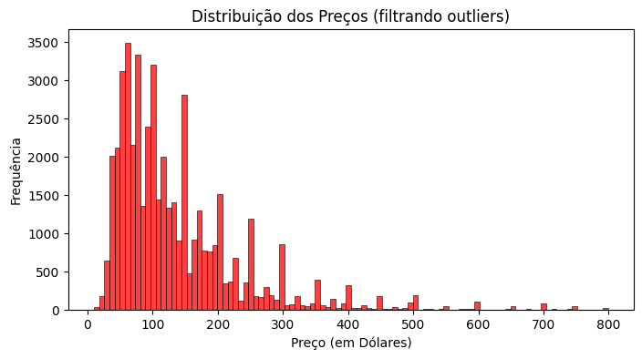
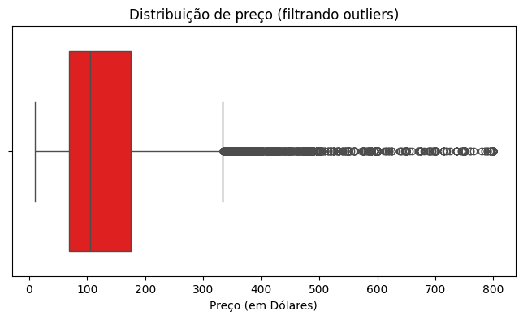
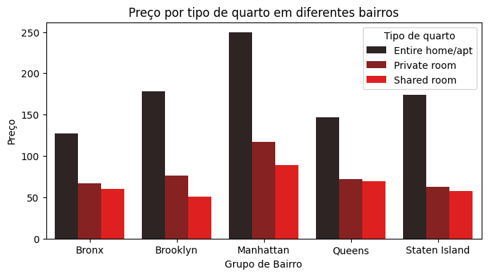
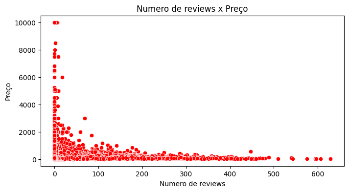
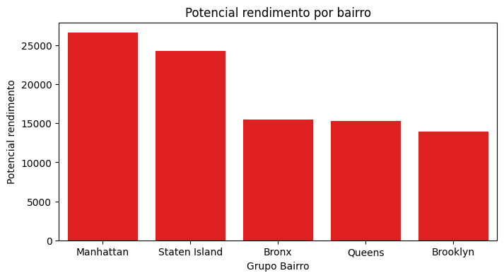
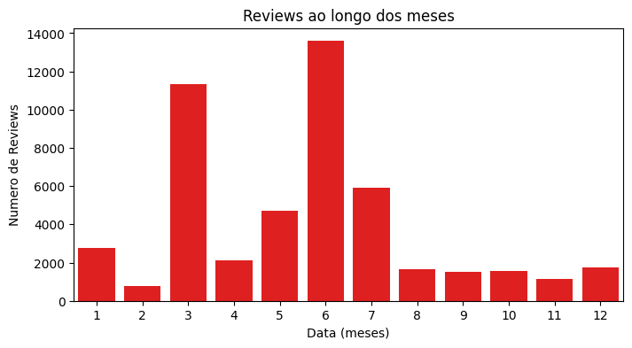
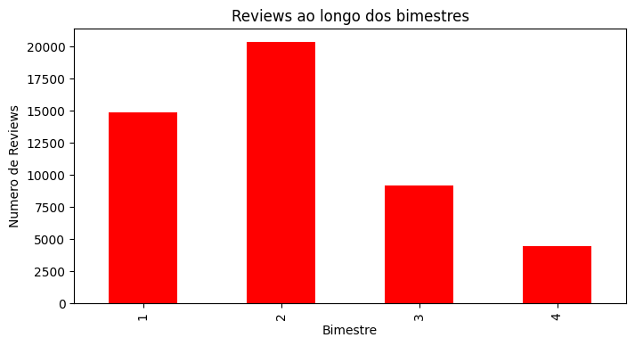
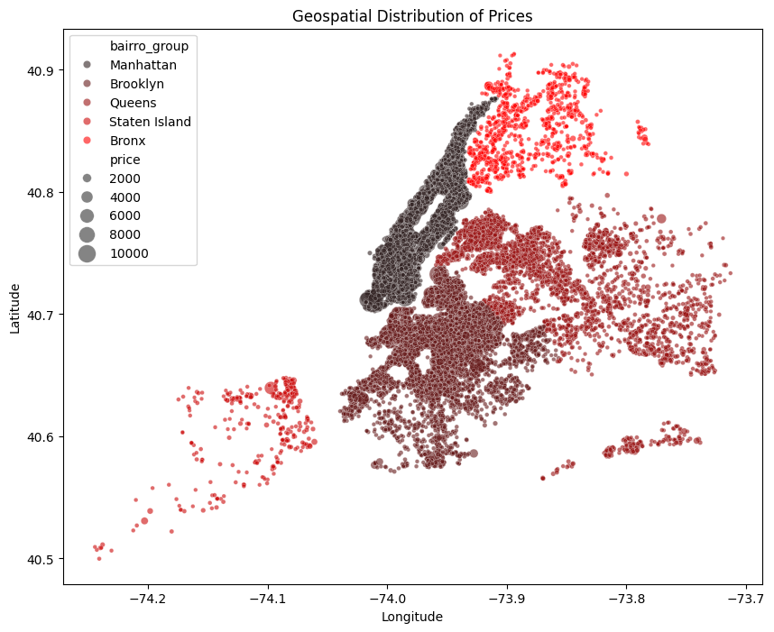
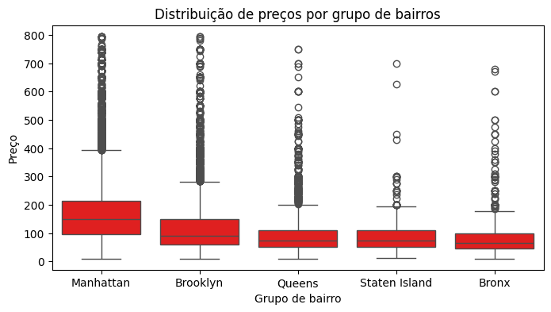

# Relatório Análise exploratória Aplicativo de aluguel temporário

Esse relatório visa ressaltar os achados, e explicar a utilização de ferramentas usadas durante a análise exploratória dos dados do Airbnb de 2019. Além disso, também serão testadas algumas hipóteses de negócio em cima dos dados.

- [Relatório Análise exploratória Aplicativo de aluguel temporário](#relatório-análise-exploratória-aplicativo-de-aluguel-temporário)
  - [Objetivos](#objetivos)
  - [Overview dos dados](#overview-dos-dados)
    - [Análise de colunas Numéricas](#análise-de-colunas-numéricas)
    - [Análise de colunas categóricas](#análise-de-colunas-categóricas)
    - [Tratamento dos dados](#tratamento-dos-dados)
      - [Preenchendo dados NaN](#preenchendo-dados-nan)
      - [Removendo dados sem preço](#removendo-dados-sem-preço)
  - [Distribuição geral dos dados de preço](#distribuição-geral-dos-dados-de-preço)
  - [Respondendo perguntas de negócio](#respondendo-perguntas-de-negócio)
    - [1. Como os preços variam entre bairros e tipos de acomodação?](#1-como-os-preços-variam-entre-bairros-e-tipos-de-acomodação)
    - [2.Anuncios com mais avaliações tem preços mais altos?](#2anuncios-com-mais-avaliações-tem-preços-mais-altos)
    - [3. Quais bairros tem maior disponibilidade e potencial de faturamento?](#3-quais-bairros-tem-maior-disponibilidade-e-potencial-de-faturamento)
    - [4.Anfitriões com mais propriedades possuem preços mais altos?](#4anfitriões-com-mais-propriedades-possuem-preços-mais-altos)
    - [5. Quando ocorrem mais reservas, existe sazonalidade?](#5-quando-ocorrem-mais-reservas-existe-sazonalidade)
    - [6. A localização afeta diretamente o preço?](#6-a-localização-afeta-diretamente-o-preço)
    - [7. O número mínimo de noites e a disponibilidade ao longo do ano interferem no preço?](#7-o-número-mínimo-de-noites-e-a-disponibilidade-ao-longo-do-ano-interferem-no-preço)
    - [8. Existe algum padrão no texto do nome do local para lugares de mais alto valor?](#8-existe-algum-padrão-no-texto-do-nome-do-local-para-lugares-de-mais-alto-valor)
  - [Modelagem](#modelagem)
    - [Tipo de modelo](#tipo-de-modelo)
    - [Possíveis aprimoramentos do modelo](#possíveis-aprimoramentos-do-modelo)
    - [Codificação](#codificação)
    - [Modelo 1](#modelo-1)
    - [Modelo 2](#modelo-2)
  - [Calculando preço para dado](#calculando-preço-para-dado)
    - [Funções](#funções)
      - [Modelo 1](#modelo-1-1)
      - [Modelo 2](#modelo-2-1)
    - [Modelo 1](#modelo-1-2)
    - [Modelo 2](#modelo-2-2)

## Objetivos

O objetivo principal da análise dos dados é responder as perguntas abaixo.

1. Como os preços variam entre bairros e tipos de acomodação?
2. Anuncios com mais avaliações tem preços mais altos?
3. Quais bairros tem maior disponibilidade e potencial de faturamento?
4. Anfitriões com mais propriedades possuem preços mais altos?
5. Quando ocorrem mais reservas, existe sazonalidade?
6. A localização afeta diretamente o preço?
7. O número mínimo de noites e a disponibilidade ao longo do ano interferem no preço?
8. Existe algum padrão no texto do nome do local para lugares de mais alto valor?

Após responder essas perguntas, foi feita uma modelagem em cima dos dados com o intuito de prever o preço que uma cliente deve atribuir ao seu imóvel, quando o disponibilizar na plataforma.

## Overview dos dados

Os dados fornecidos são compostos por um total de $16$ colunas e $48894$ entradas.

```python
df.shape
```

```
output: df.info()
```

As colunas de features e suas definições são as seguintes:

- `id` - Atua como uma chave exclusiva para cada anúncio nos dados do aplicativo `texto`
- `nome` - Representa o nome do anúncio - `texto`
- `host_id` - Representa o id do usuário que hospedou o anúncio - `texto`
- `host_name` – Contém o nome do usuário que hospedou o anúncio - `texto`
- `bairro_group` - Contém o nome do bairro onde o anúncio está localizado - `texto/categórico`
- `bairro` - Contém o nome da área onde o anúncio está localizado - `texto/categórico`
- `latitude` - Contém a latitude do local - `numérico`
- `longitude` - Contém a longitude do local - `numérico`
- `room_type` – Contém o tipo de espaço de cada anúncio - `texto/categórico`
- `price` - Contém o preço por noite em dólares listado pelo anfitriã - `numérico`
- `minimo_noites` - Contém o número mínimo de noites que o usuário deve reservar - `numérico`
- `numero_de_reviews` - Contém o número de comentários dados a cada listagem - `numérico`
- `ultima_review` - Contém a data da última revisão dada à listagem - `data`
- `reviews_por_mes` - Contém o número de avaliações fornecidas por mês - `numérico`
- `calculado_host_listings_count` - Contém a quantidade de listagem por host - `numérico`
- `disponibilidade_365` - Contém o número de dias em que o anúncio está disponível para reserva - `numérico`

Cada uma com a seguinte quantidade de dados únicos

```python
df.nunique()
```

```
id                               48894
nome                             47904
host_id                          37457
host_name                        11452
bairro_group                         5
bairro                             221
latitude                         19048
longitude                        14718
room_type                            3
price                              674
minimo_noites                      109
numero_de_reviews                  394
ultima_review                     1764
reviews_por_mes                    937
calculado_host_listings_count       47
disponibilidade_365                366
dtype: int64
```

e a seguinte quantidade de dados nulos

```python
df.isna().sum()
```

```
id                                   0
nome                                16
host_id                              0
host_name                           21
bairro_group                         0
bairro                               0
latitude                             0
longitude                            0
room_type                            0
price                                0
minimo_noites                        0
numero_de_reviews                    0
ultima_review                    10052
reviews_por_mes                  10052
calculado_host_listings_count        0
disponibilidade_365                  0
dtype: int64
```

### Análise de colunas Numéricas

Fazendo resumo estatístico dos dados numéricos, com média, mediana, desvio padrão e análise de quartis.

```python
numericos = df[
    [
        'price',
        'minimo_noites',
        'numero_de_reviews',
        'reviews_por_mes',
        'calculado_host_listings_count',
        'disponibilidade_365',
    ]
]
```

|       |        price | minimo_noites | numero_de_reviews | reviews_por_mes | calculado_host_listings_count | disponibilidade_365 |
| ----: | -----------: | ------------: | ----------------: | --------------: | ----------------------------: | ------------------: |
| count | 48894.000000 |  48894.000000 |      48894.000000 |    38842.000000 |                  48894.000000 |        48894.000000 |
|  mean |   152.720763 |      7.030085 |         23.274758 |        1.373251 |                      7.144005 |          112.776169 |
|   std |   240.156625 |     20.510741 |         44.550991 |        1.680453 |                     32.952855 |          131.618692 |
|   min |     0.000000 |      1.000000 |          0.000000 |        0.010000 |                      1.000000 |            0.000000 |
|   25% |    69.000000 |      1.000000 |          1.000000 |        0.190000 |                      1.000000 |            0.000000 |
|   50% |   106.000000 |      3.000000 |          5.000000 |        0.720000 |                      1.000000 |           45.000000 |
|   75% |   175.000000 |      5.000000 |         24.000000 |        2.020000 |                      2.000000 |          227.000000 |
|   max | 10000.000000 |   1250.000000 |        629.000000 |       58.500000 |                    327.000000 |          365.000000 |

Algumas informações relevantes são, por exemplo a existência de dados com preço igual a zero.

### Análise de colunas categóricas

Contagem de dados nas tabelas categoricas, número de dados únicos, e quantidade dos valores dentro das tabelas.

```python
categoricos = df[['bairro_group', 'room_type', 'bairro']]
```

- Número total de dados

```python
categoricos.nunique()
```

```
bairro_group 5
room_type 3
bairro 221
dtype: int64
```

- Número de dados únicos:
  - Número de valores únicos em `bairro`:
    ```python
    df.value_counts(['bairro'])
    ```
    ```
    bairro
    Williamsburg          3920
    Bedford-Stuyvesant    3714
    Harlem                2658
    Bushwick              2465
    Upper West Side       1971
                        ...
    Richmondtown             1
    Willowbrook              1
    Fort Wadsworth           1
    New Dorp                 1
    Woodrow                  1
    Name: count, Length: 221, dtype: int64
    ```
  - Número de valores únicos em `bairro_group`:
    ```python
    df.value_counts(['bairro_group'])
    ```
    ```
    bairro_group
    Manhattan        21661
    Brooklyn         20103
    Queens            5666
    Bronx             1091
    Staten Island      373
    Name: count, dtype: int64
    ```
  - Número de valores únicos em `room_type`:
    ```python
    df.value_counts(['room_type'])
    ```
    ```
    room_type
    Entire home/apt    25409
    Private room       22325
    Shared room         1160
    Name: count, dtype: int64
    ```

Algumas coisas a notar sobre os dados categóricos, primeiramente, o número de dados únicos de `bairro` inviabiliza a utilização de `OneHotEncoding` para treinamento do modelo, porque pela natureza desse tipo de codificação, a dimensionalidade do dataset aumentaria excessivamente. Segundo, notamos que a maior parte das propriedades para aluguel se encontra ou em Manhattan ou no Brooklyn (quase 5 vezes a mais que no terceiro maior bairro). Terceiro, a quantidade de quartos compartilhados é muito menor do que a de quartos privados/apartamentos inteiros.

### Tratamento dos dados

#### Preenchendo dados NaN

Como evidenciado quando rodamos o comando `df.isna().sum()`, existe uma grande quantidade de dados nulos que precisam de forma ou outra ser tratados:

```
nome                                16
host_name                           21
ultima_review                    10052
reviews_por_mes                  10052
```

A relevância de tratamento dos nomes das propriedades é mais baixa do que o número de reviews por mês, visto que um dado não seria considerado no treinamento de um modelo. De qualquer forma, apenas o nome do host será tratado, sendo removido como um todo da tabela.

Os valores vazios de `nome` da propriedade serão preenchidos com uma combinação $nome\ do\ bairro + tipo\ de\ quarto$. Os valores vazios de `ultima_review`, serão primeiro transformados para dados de tempo (`datetime`) e em seguida, serão preenchidos com o menor valor presente na coluna. Finalmente, os valores que não tem dados de review mensais, serão completados com zero.

```python
df.ultima_review = pd.to_datetime(df.ultima_review)
df.fillna(
    {
        'nome': df.bairro + ' ' + df.room_type,
        'reviews_por_mes': 0,
        'ultima_review': df.ultima_review.min(),
    },
    inplace=True,
)
df.drop('host_name', inplace=True, axis=1)
```

#### Removendo dados sem preço

Como evidenciado na análise descritiva dos dados numéricos, existem entradas com valores nulos. Esses dados tem valor zero, tanto para a análise, quanto para a construção de um modelo preditivo, portanto eles serão removidos.

Primeiramente contamos quantos dados de preço igual a zero existem:

```python
df[df['price'] == 0].shape
```

```
(11, 15)
```

Um total de 11 entradas com valor do preço igual a zero.

Fazemos a retirada completa dos dados:

```python
index_zero = df[df['price'] == 0].index

df.drop(index_zero, inplace=True)
```

Feito isso, o tratamento dos dados está completo.

## Distribuição geral dos dados de preço

De forma a analisar os dados de forma menos tendenciosa para outliers, primeiramente filtraremos os dados que são menores do que o percentil $99%$.

```python
filtered_df = df[df['price'] <= df['price'].quantile(0.99)]
```

Feito isso, podemos fazer visualizações mais informativas sobre a distribuição de preços do gráfico:

- Histograma

  

- BoxPlot

  

A distribuição dos valores de preço segue abaixo:

```
count    48883.000000
mean       152.755130
std        240.172716
min         10.000000
25%         69.000000
50%        106.000000
75%        175.000000
max      10000.000000
```

Com o valor mais alto sendo de $\$10.000$, o valor médio de $\$152,75$, e mediana de $\$106$.

## Respondendo perguntas de negócio

### 1. Como os preços variam entre bairros e tipos de acomodação?

Para fazer a análise de como os preços variam entre bairros e tipos de acomodação, primeiramente, foi feito um `groupby` nas colunas `bairro_group` e `room_type`, e em cima da coluna `price` foram tiradas medidas de média mínimo e máximo.

```python
df.groupby(['bairro_group', 'room_type'])['price'].agg(
    [
        'mean',
        'min',
        'max',
    ]
)
```

Obtendo a tabela:

|  bairro_group |       room_type |        max | max |   max |
| ------------: | --------------: | ---------: | --: | ----: |
|         Bronx | Entire home/apt | 127.506596 |  28 |  1000 |
|               |    Private room |  66.890937 |  10 |  2500 |
|               |     Shared room |  59.800000 |  20 |   800 |
|      Brooklyn | Entire home/apt | 178.346202 |  10 | 10000 |
|               |    Private room |  76.538272 |  10 |  7500 |
|               |     Shared room |  50.773723 |  15 |   725 |
|     Manhattan | Entire home/apt | 249.257994 |  10 | 10000 |
|               |    Private room | 116.776622 |  10 |  9999 |
|               |     Shared room |  88.977083 |  10 |  1000 |
|        Queens | Entire home/apt | 147.050573 |  10 |  2600 |
|               |    Private room |  71.762456 |  10 | 10000 |
|               |     Shared room |  69.020202 |  11 |  1800 |
| Staten Island | Entire home/apt | 173.846591 |  48 |  5000 |
|               |    Private room |  62.292553 |  20 |   300 |
|               |     Shared room |  57.444444 |  13 |   150 |

Fazendo uma breve análise em cima dos dados da tabela, é possível observar que as médias, assim como os valores máximos de Manhattan são os maiores em todos os quesitos comparativos com outros bairros.



A partir do gráfico acima, é possível visualizar a diferença entre os preços dos diferentes tipos de quarto nos grupos de bairros.

### 2.Anuncios com mais avaliações tem preços mais altos?

Para analisar se o número de reviews tem influência no preço dos imóveis, podemos fazer uma simples correlação entre as colunas de `numero_de_reviews` e `price`:

```python
df['numero_de_reviews'].corr('price')
```

Obtendo:

```
-0.05
```

Esse valor bota em cheque a possibilidade de que apartamentos com maior número de avaliações tem preços maiores. A correlação entre os valores ser baixa (perto de 0) indica que existe pouca influência entre o preço do aluguel do imóvel e o número de reviews que ele possui. A correlação ter valor negativo, indica uma tendência de que a medida que o número de reviews aumenta, o preço diminui.



Criando um gráfico de dispersão, é possível perceber que existe pouca linearidade na relação $preço\ X\ numero\ de\ reviews$, sendo grande parte dos valores concentrados no início do gráfico, e a medida que o número de reviews aumenta, o preço diminui (atestando pela correlação negativa).

### 3. Quais bairros tem maior disponibilidade e potencial de faturamento?

Para fazer uma análise do potencial faturamento de imóveis conforme a sua disponibilidade no próximo ano, simplesmente multiplicaremos o número de dias disponíveis pelo preço da diária do aluguel. Com isso, podemos fazer uma agregação dos dados e ordená-los, de forma a encontrar o maior possível rendimento (em média) em Manhattan.

```python
df['rendimento_potencial'] = df['price'] * df['disponibilidade_365']
df.groupby('bairro_group').agg(
    rendimento_medio=('rendimento_potencial', 'mean')
).sort_values(by='rendimento_medio', ascending=False)
```

Obtendo:

|  bairro_group | rendimento_medio |
| ------------: | ---------------: |
|     Manhattan |     26610.229455 |
| Staten Island |     24308.227882 |
|         Bronx |     15500.551376 |
|        Queens |     15264.282210 |
|      Brooklyn |     13922.355629 |

Visualização das medidas em gráfico:



Os valores não garantem o retorno representado, sendo apenas uma média dos retorno que pode ser obtido a partir do aluguel dos imóveis vagos (para os próximos 365 dias).

### 4.Anfitriões com mais propriedades possuem preços mais altos?

Essa análise tem o intuito de comparar o preço médio do aluguel dos anfitriões com maior quantidade de listagens, com o preço médio de aluguel das propriedades, e dos anfitriões com menores números de listagens.

```python
host_analysis = (
    df.groupby('host_id')
    .agg(listings_count=('host_id', 'size'), avg_price_per_host=('price', 'mean'))
    .reset_index()
    .sort_values(by='listings_count', ascending=False)
)
```

Obtendo:

|       |   host_id | listings_count | avg_price_per_host |
| ----: | --------: | -------------: | -----------------: |
| 34644 | 219517861 |            327 |         253.195719 |
| 29405 | 107434423 |            232 |         303.150862 |
| 19572 |  30283594 |            121 |         277.528926 |
| 31077 | 137358866 |            103 |          43.825243 |
| 12805 |  12243051 |             96 |         213.031250 |
|   ... |       ... |            ... |                ... |
| 13357 |  13540183 |              1 |         150.000000 |
| 13356 |  13538150 |              1 |          97.000000 |
| 13355 |  13535952 |              1 |         300.000000 |
| 13354 |  13533446 |              1 |         139.000000 |
| 37454 | 274321313 |              1 |         125.000000 |

Calculando a média:

```python
top_20_avg_price = host_analysis.head(20)['avg_price_per_host'].mean()
bottom_20_avg_price = host_analysis.tail(20)['avg_price_per_host'].mean()
```

Obtendo:

```
Preço médio anfitriões com 20 mais propriedades: 195.61
Preço médio 20 anfitriões com menos propriedades: 157.10
```

É possível perceber que a quantidade de listagens influencia pouco no preço, com uma variação de aproximadamente $\$38.5$.

### 5. Quando ocorrem mais reservas, existe sazonalidade?

A ideia por trás dessa análise, é observar o número de reviews que são postadas a cada mês, para visualizar se existem meses com maior número de reviews, e por consequência, maior número de alugueis.

Analisando a quantidade de reviews que ocorrem ao longo do ano, é possível perceber que os meses de Março e Junho, possuem um número elevado de reviews em comparação com os outros meses.



De forma a generalizar um pouco mais, podemos visualizar a quantidade de reviews por cada bimestre do ano.



A conclusão que chegamos, é que o segundo bimestre do ano, tende a possuir uma quantidade maior de alugueis.

### 6. A localização afeta diretamente o preço?

A localização do imóvel ser determinante para seu preço é algo muito lógico a se pensar, portanto se prova uma análise simples mas necessária. Para tal análise, foram escolhidas medidas de média

```python
df.groupby('bairro_group')['price'].agg(
    [
        'mean',
        'min',
        '50%'
        'max',
    ]
).sort_values('mean', ascending=False)
```

Obtendo:

|  bairro_group |       mean | min | median |   max |
| ------------: | ---------: | --: | -----: | ----: |
|     Manhattan | 196.884903 |  10 |  150.0 | 10000 |
|      Brooklyn | 124.437693 |  10 |   90.0 | 10000 |
| Staten Island | 114.812332 |  13 |   75.0 |  5000 |
|        Queens |  99.517649 |  10 |   75.0 | 10000 |
|         Bronx |  87.577064 |  10 |   65.0 |  2500 |

Como esperado, é possível perceber que Manhattan lidera o rank de maior valor médio por grande margem.



De forma a visualizar a rede de imóveis, foi feita uma visualização usando as coordenadas das listagens.



O gráfico acima, serve de forma a corresponder as expectativas de que os preços em Manhattan são consideravelmente maiores do que os de qualquer outro grupo de bairros. É possível observar que a mediana de Manhattan chega muito próxima à fronteira do percentil 75% do Brooklyn, o segundo bairro com maiores valores de preço.

### 7. O número mínimo de noites e a disponibilidade ao longo do ano interferem no preço?

Assim como para entender a influência do número de avaliações no preço, podemos fazer com outros valores numéricos, nominalmente, o número de noites e a disponibilidade ao longo do próximo ano.

```python
df[['price', 'minimo_noites', 'disponibilidade_365']].corr()['price']
```

Obtendo:

```
minimo_noites          0.042805
disponibilidade_365    0.081851
```

É possível perceber que, apesar de apresentar valores mais altos (em específico quanto à disponibilidade), ainda existe baixa proporcionalidade entre os dados.

### 8. Existe algum padrão no texto do nome do local para lugares de mais alto valor?

Analisar o nome das propriedades de maior valor pode trazer algum insight sobre como características das listagens podem influenciar no preço. Para isso pegaremos os $100$ dados mais caros e faremos uma análise em cima deles.

```python
names_price = (
    df[['nome', 'price']].sort_values(by='price', ascending=False)[:100].copy()
)
names_dict = {}

for _, nome_price in names_price.iterrows():
    nome = nome_price['nome'].lower()
    price = nome_price['price']

    for word in nome.split():
        if word in names_dict:
            names_dict[word][0] += 1
            names_dict[word][1].append(price)
        else:
            names_dict[word] = [1, [price]]

word_avg_price = {
    word: [count, np.mean(prices)] for word, (count, prices) in names_dict.items()
}
word_df = pd.DataFrame(
    [(word, count, price) for word, (count, price) in word_avg_price.items()],
    columns=['word', 'count', 'price'],
)
word_df.sort_values(by='count', ascending=False, inplace=True)
```

O código acima faz a transformação dos dados, primeiramente tornando todas as letras do anuncio minúsculas, em seguida iterando sobre as palavras individualmente, adicionando a um dicionário `names_dict` apenas as palavras que não estão presentes ainda. Caso as palavras estiverem no dicionário, um contador é incrementado. Além de manter o contador, também são registrados os valores de aluguel de imoveis que contém dada palavra. O algoritmo não é o mais eficiente com complexidade $O(N \times M)$.

```python
most_common_words = word_df[:25].copy()
```

Em seguida, selecionamos apenas as primeiras 25 palavras.

```python
most_common_words.drop(
    'in by - (hidden airbnb) for 1 with 2'.split(), axis=0, inplace=True
)
most_common_words.shape
```

Obtendo:

```
(16, 2)
```

Limpamos as preposições do texto. Após isso, selecionaremos apenas as 10 palavras com mais frequência dentro dos alugueis mais caros.

```python
most_common_words[:10]
```

|      word | count |       price |
| --------: | ----: | ----------: |
|    luxury |    12 | 4604.166667 |
| apartment |    10 | 4389.000000 |
|   bedroom |    10 | 3680.000000 |
| townhouse |     8 | 3852.375000 |
|      park |     8 | 2992.500000 |
|      room |     6 | 4175.000000 |
|      loft |     6 | 3041.666667 |
|  location |     6 | 4725.000000 |
|      west |     6 | 3269.166667 |
|   private |     6 | 3316.666667 |

É possível notar que a palavra mais presente nas propriedades com aluguel mais caro é a palavra **_luxury_**.

## Modelagem

A modelagem é dividida em duas seções, a primeira usando apenas os dados fornecidos, enquanto a segunda se baseia em dados com um maior número de features.

### Tipo de modelo

Ambos os modelos são `RandomForestRegressor`. `RandomForestRegressor` é um tipo de modelo de machine learning utilizado para tarefas de regressão, onde o tipo de valor a ser previsto é de natureza contínua, como é o nosso caso, vez que temos a intenção de fornecer um preço adequado conforme o tipo de listagem. Esses modelos são derivados de RandomForest, uma técnica que junta várias árvores de decisão com objetivo de diminuir overfitting.

Árvores de decisão funcionam de tal forma a separar dados em "folhas" usando uma série de decisões, se assemelhando a árvores, onde os nós são os pontos de separação dos dados.

[RandomForestRegressor documentation](https://scikit-learn.org/stable/modules/generated/sklearn.ensemble.RandomForestRegressor.html)

```python
model = Pipeline(
    [
        ('preprocessor', preprocessor),
        ('model', RandomForestRegressor()),
    ],
)
```

Antes da instanciação do modelo, ele passa por um pré-processamento

### Possíveis aprimoramentos do modelo

De forma a obter um modelo mais robusto, pode ser feita uma análise de como fazer a tunagem dos hiperparâmetros do modelo. Como estamos usando `RandomForestRegressors`, a documentação referente ao modelo do Scikit-Learn traz informações sobre os diferentes parâmetros e como ajusta-los. Os parâmetros escolhidos para analisar são os abaixo.

```python
pipe_grid = {
    'model__n_estimators': [100, 300, 500, 1000],
    'model__max_depth': [None, 10, 20, 30],
    'model__min_samples_split': [2, 5, 10, 15],
    'model__min_samples_leaf': [1, 2, 5, 10],
    'model__max_features': ['sqrt', 'log2', None],
    'model__bootstrap': [True, False],
}
```

### Codificação

A codificação dos dados foi feita da seguinte forma:

```python
categorical_transformer = TargetEncoder(
    categories='auto',
    target_type='continuous',
    smooth=0.2,
)

numerical_transformer = Pipeline(
    [
        ('imputer', SimpleImputer(strategy='mean')),
        ('scaling', StandardScaler()),
    ],
)


preprocessor = ColumnTransformer(
    transformers=[
        ('cat', categorical_transformer, categorical_features),
        ('num', numerical_transformer, numerical_features),
    ]
)
```

As features numéricas passam por dois processos, o primeiro sendo um `SimpleImputer` que completa qualquer dado faltante com a média da coluna de tal dado. Em seguida, o modelo passa por um `StandardScaler` que torna a média dos valores $0$ e a sua variância $1$. A fórmula para o `StandardScaler` é:

$$X_{scaled} = \frac{X - \mu} {\sigma}$$

Com $X_{scaled}$ sendo o novo valor, $X$ o valor prévio, $\mu$ a média, e $\sigma$ o desvio padrão. [StandardScaler documentation](https://scikit-learn.org/stable/modules/generated/sklearn.preprocessing.StandardScaler.html)

As features categóricas passam por apenas um passo de `TargetEncoder` que faz com que seu valor seja codificado conforme a média do valor pretendido. Foi usado scaling para prevenção de overfitting. O parâmetro `categories='auto'` determina o tipo do dado automaticamente, `target_type='continuous'` determina o tipo do alvo, nesse caso contínuo, e finalmente, `smooth=0.2` determina a quantidade de mistura da média do alvo com a média global. [TargetEncoder documentation](https://scikit-learn.org/stable/modules/generated/sklearn.preprocessing.TargetEncoder.html)

### Modelo 1

As features consideradas habéis para treinamento do modelo foram separadas em numéricas e categóricas e podem ser encontradas abaixo.

```python
categorical_features = ['bairro_group', 'bairro', 'room_type']

numerical_features = [
    'minimo_noites',
    'numero_de_reviews',
    'reviews_por_mes',
    'calculado_host_listings_count',
    'disponibilidade_365',
]
```

O treinamento do modelo foi feito usando `RandomizedSearchV` para buscar os melhores hiperparâmetros.

```python
rs_model = RandomizedSearchCV(model, pipe_grid, cv=5, verbose=2, n_jobs=5)
rs_model.fit(X_train, y_train)
```

O modelo obteve resultados baixos

```python
score_test, score_train = rs_model.score(X_test, y_test), rs_model.score(
    X_train, y_train
)
score_test, score_train
```

```
(0.11984758172607968, 0.36034286370632795)
```

Fica evidente que o modelo teve problemas de obter grande aprendizado proveniente dos dados, algumas possíveis soluções seriam fazer um "_Data Augmentation_" que foge à realidade dos dados, outra seria conseguir um volume maior de dados de AirBnB em Nova Iorque, e finalmente, conseguir dados que possuam um maior número de features utilizáveis, vez que fazemos uso de apenas $8$ features para treinamento.

### Modelo 2

A diferença entre os dois modelos jaz na quantidade de features no qual ele foi treinado. O primeiro modelo foi treinado apenas nos dados fornecidos, enquanto para o segundo modelo, após performance ruim com os dados base, foi treinado em uma base de dados com um maior número de features.
s
Os dados foram obtidos desse [link](https://insideairbnb.com/get-the-data/), que possui dados da empresa AirBnB de uma série de cidades e países. O dicionário dos dados pode ser encontrado [junto aos outros dados](../dataset/listings_csv_data_dict.pdf). Esses dados possuem em sua forma bruta 75 colunas de dados.

Após análise breve das colunas mais relevantes para a modelagem, foram escolhidas as seguintes features:

```python
categorical_features = [
    'neighbourhood_cleansed',
    'neighbourhood_group_cleansed',
    'property_type',
    'room_type',
    'bathrooms_text',
]
numerical_features = [
    'beds',
    'bedrooms',
    'accommodates',
    'minimum_nights',
    'maximum_nights',
    'minimum_nights_avg_ntm',
    'maximum_nights_avg_ntm',
    'availability_365',
    'number_of_reviews',
    'calculated_host_listings_count',
    'reviews_per_month',
    'review_scores_value',
    'review_scores_rating',
    'review_scores_checkin',
    'review_scores_location',
    'review_scores_accuracy',
    'review_scores_cleanliness',
    'review_scores_communication',
]
```

A codificação dos dados foi feita igual ao outro modelo, salvo a implementação de um `SimpleImputer` juntamente ao `TargetEncoder` para os dados categóricos:

```python
categorical_transformer = Pipeline(
    steps=[
        ('imputer', SimpleImputer(strategy='most_frequent')),
        (
            'target_encoding',
            TargetEncoder(categories='auto', target_type='continuous', smooth=0.2),
        ),
    ]
)
```

O treinamento do modelo foi feito usando `RandomizedSearchV` para buscar os melhores hiperparâmetros.

```python
rs_model = RandomizedSearchCV(model, param_grid, cv=5, verbose=2, n_jobs=5)
rs_model.fit(X_train, y_train)
```

Fazendo teste do modelo nos dados de teste e treino respectivamente.

```python
score_test, score_train = rs_model.score(X_test, y_test), rs_model.score(
    X_train, y_train
)
score_test, score_train
```

```
(0.3869951467443793, 0.589647105798486)
```

Com a utilização de uma maior quantidade de features, o modelo conseguiu treinar de forma mais adequada e generalizar de forma mais eficiente nos dados de treino, quase quadruplicando o score nos dados de teste, mesmo com um dataset com menos entradas.

## Calculando preço para dado

Finalmente, após a modelagem, podemos testar os dados para a seguinte entrada:

```python
dados = {
    'id': 2595,
    'nome': 'Skylit Midtown Castle',
    'host_id': 2845,
    'host_name': 'Jennifer',
    'bairro_group': 'Manhattan',
    'bairro': 'Midtown',
    'latitude': 40.75362,
    'longitude': -73.98377,
    'room_type': 'Entire home/apt',
    'minimo_noites': 1,
    'numero_de_reviews': 45,
    'ultima_review': '2019-05-21',
    'reviews_por_mes': 0.38,
    'calculado_host_listings_count': 2,
    'disponibilidade_365': 355,
}
```

### Funções

Pela natureza dos nomes dos modelos, e a quantidade de dados esperada por ambos, a função usada para fazer a predição do dado é diferente.

#### Modelo 1

Aqui usamos os nomes em português das features, além te termos apenas 15 features totais.

```python
def predict_data(model: BaseEstimator, data: dict[str, Any] = None) -> float:
    '''
    Takes a model and uses it to predict a value for a set of data

    data: takes a dict containing the dict to predict, by default `None`
    '''
    if not data:
        data = pd.DataFrame(
            {
                'nome': ['Skylit Midtown Castle'],
                'host_id': ['Jennifer'],
                'bairro_group': ['Manhatan'],
                'bairro': ['Midtown'],
                'latitude': [40.75362],
                'longitude': [-73.98377],
                'room_type': ['Entire home / apt'],
                'minimo_noites': [1],
                'numero_de_reviews': [45],
                'ultima_review': ['2019-05-21'],
                'reviews_por_mes': [0.38],
                'calculado_host_listings_count': [2],
                'disponibilidade_365': [355],
            },
        )
    prediction = model.predict(data)

    return float(prediction[0])
```

A função recebe uma instância de modelo e usa ele para fazer a previsão em cima de dados `data` (por padrão None, para usar o dict de dados fornecido).

#### Modelo 2

O modelo dois precisa de um tratamento extra dos dados, portanto sua função é mais simples, porém contem mais linhas.

```python
def model_predict(model: BaseEstimator) -> float:
    prediction = model.predict(
        pd.DataFrame(
            {
                'name': ['Skylit Midtown Castle'],
                'host_id': 2845,
                'host_name': ['Jennifer'],
                'neighbourhood_group_cleansed': ['Manhatan'],
                'neighbourhood_cleansed': ['Midtown'],
                'latitude': [40.75362],
                'longitude': [-73.98377],
                'room_type': ['Entire home / apt'],
                'minimum_nights': [1],
                'number_of_reviews': [45],
                'last_review': ['2019-05-21'],
                'reviews_per_month': [0.38],
                'calculated_host_listings_count': [2],
                'availability_365': [355],
                'accommodates': None,
                'bathrooms_text': None,
                'review_scores_rating': None,
                'review_scores_location': None,
                'maximum_nights': None,
                'review_scores_checkin': None,
                'bedrooms': None,
                'property_type': None,
                'maximum_nights_avg_ntm': None,
                'review_scores_accuracy': None,
                'beds': None,
                'review_scores_value': None,
                'review_scores_communication': None,
                'review_scores_cleanliness': None,
                'minimum_nights_avg_ntm': None,
            },
        )
    )
    return float(prediction[0])
```

### Modelo 1

Previsão do modelo 1

```python
predict_data(rs_model)
```

```
363.36812445887443
```

### Modelo 2

Previsão do modelo 2

```python
model_predict(rs_model)
```

```
276.8228462563686
```
